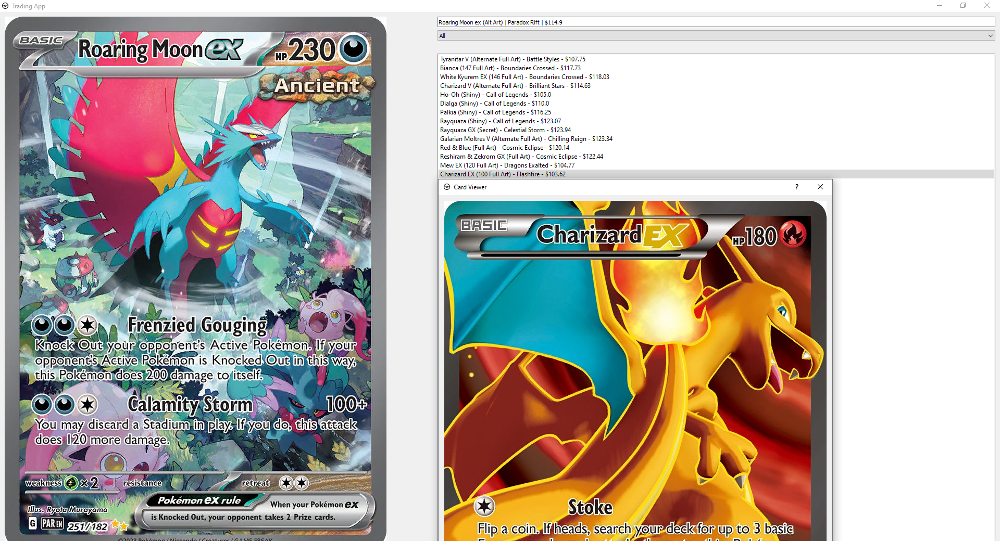

<!-- Trading App - Pokémon Card Value Checker -->

# Trading App - Pokémon Card Value Checker

This app is designed to help you determine the trade value of your Pokémon cards. Follow these simple steps:

## How to Use the App

1. Enter the name of your Pokémon card in the search bar.
2. Hit Enter or select from the suggested cards.
3. You will receive a list of Pokémon cards whose values are within a range of 10% above or below your card's estimated value.
4. Click on a card's name to view a photo of the card.

## About the App

This app helps you make informed decisions about the value of your Pokémon cards when trading. It's a handy tool for collectors and traders alike. 

At the moment the card database contains cards from XY-SV (Excluding Promos), older cards will be added in the future!

Happy trading!

